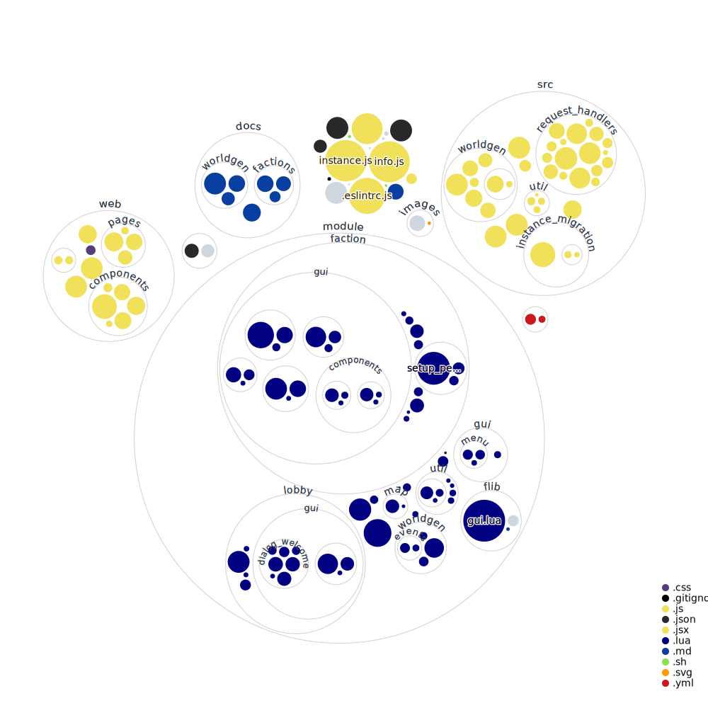

# Clusterio gridworld

Automatic gridworld configuration

## [Documentation and FAQ](docs/docs.md)

## Installation

Dependencies:

* https://www.npmjs.com/package/@hornwitser/server_select
* https://www.npmjs.com/package/@clusterio/plugin-edge_transports

Run the following commands in the folder Clusterio is installed to:

	npm install @danielv123/gridworld
	npx clusteriomaster plugin add @danielv123/gridworld

Substitute clusteriomaster with clusterioslave or clusterioctl if this a dedicated slave or ctl installation respectively.

## Development setup

Clone the repository in clusterio/external_plugins/

	cd clusterio
	pnpm install
	node packages/ctl plugin add ./external_plugins/gridworld
	pnpm install @clusterio/plugin-edge_transports -w
	pnpm install @hornwitser/server_select -w
	node packages/master/ bootstrap create-admin Danielv123
	node packages/master plugin add @clusterio/plugin-edge_transports
	node packages/master plugin add @hornwitser/server_select
	node packages/master plugin add ./plugins/global_chat
	node packages/master plugin add ./plugins/inventory_sync
	node packages/master plugin add ./plugins/player_auth
	node packages/master plugin add ./plugins/research_sync
	node packages/master plugin add ./plugins/statistics_exporter
	node packages/master/ bootstrap generate-user-token Danielv123 > token.txt
	node packages/master run --dev --dev-plugin gridworld

Log into the webui with the token in token.txt and create a new slave token with id `1` then run the following in terminal to setup the slave:

	wget -O factorio.tar.gz https://www.factorio.com/get-download/latest/headless/linux64
	tar -xf factorio.tar.gz
	node packages/slave config set slave.id 1
	node packages/slave config set slave.master_token xxxxxxxxxxxxxxxxxxxxx
	node packages/slave config set slave.name "Slave 1"
	node packages/slave config set slave.public_address "localhost"
  
Luacheck can be downloaded from https://github.com/mpeterv/luacheck/releases/download/0.23.0/luacheck.exe or `sudo apt install lua-check`

Put it in your `%path%` and run `luacheck ./module`
